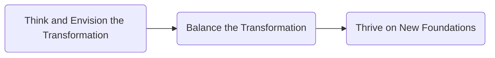

# The Cloud Adoption Playbook

Proven strategies for transforming your organization with the cloud

Author: Moe Abdula, Ingo Averdunk, Roland Barcia, Kyle Brown, Ndu Emuchay (2018)

Borrowed from Pointe-Claire Library, July 2021

[toc]

# Introduction

# 1. Business Drivers

# 2. Framework Overview

Outside-in approach with establishing 3 simple themes:

- ___Think and Envision the Transformation to establish the strategic intent of the transformation.___ This step is the most important one. As we stated earlier, the cloud is a means to an end. First, you must determine what goals the business wants to achieve before your begin any other planning.
- ___Balance the Transformation to decide what works best for the enterprise.___ Just as Rome wasn't built in a day, an enterprise doesn't fully move onto the cloud in a day, or even in a year. There is always a balance that must be struck in understanding what aspects of the digital transformation you can move toward quickly and what parts will take more time.
- ___Thrive on New Foundations to realize the strategic outcomes at scale and over a sustained period (typically, three to five years).___ We want to help build organizations that are successful over the long run, which means going well beyond moving a single project to the cloud or transforming a single development team. To be successful over that time frame, you must establish organizational structures, policies, and procedures that are resilient and effective in the face of a rapidly changing technology landscape.

# 3. Strategy

_A vision without a strategy remains an illusion. -- Lee Bolman_

_Sometimes you have to slow down to speed up._

_Strategy_ is that which enables alignment between vision and execution. (Strategy is a set of integrated decisions that guide you in aligning with a defined vision relative tot he competition.)

A strategy enables you to decide

- what markets to participate in
- how to participate
- what capabilities you must have to be successful (including technology, talent, and skill)

A strategy also tells you

- what management systems need to be in place to be effective
- the time frame in which they need to be executed to be relevant
- how you know that you are succeeding

Important dimensions of cloud strategy:

- Culture and organization
- Architecture and technology
- Security and compliance
- Emerging Innovation Spaces
- Methodology
- Service Management and Operations
- Governance

Prescriptive Steps to Develop a Cloud Strategy:

Key considerations should a Cloud Strategy address?

1. Service types: IaaS, PaaS, SaaS (Data, Cognitive, Solutions)
2. Deployment models (Hosted Private Cloud, Managed Private Cloud, Private Cloud, Dedicated Public Cloud Services, Shared Public Cloud Services)
3. Roles (Consumer, Integrator, Provider)
4. Controls
5. Vendor relationships

## Prescriptive Steps are required to develop a Cloud Strategy

### 1. Define business objectives and constraints

- Competitiveness: the ability to respond to a market opportunity with unique value, often leverage design, technology, and operational excellence as differentiators.
- Agility: the ability to pivot, proactively react, and respond to changing business realities in a rapid, sustained fashion. All part of the organization (business, IT, and supporting functions) must be able to react at (or at nearly) the same pace for the organization to respond in an agile way.
- Speed: the ability to innovate and change faster than your current pace and show results quickly. Speed presumes the ability to do so through more efficient execution across the value stream.
- Cost saving: the ability to take advantage of the collective resource pool, which ultimately means saving money. It requires that you create efficiencies across the value stream without shifting the burden from one side to another.
- Focus: the ability to pay attention to your core business to the exclusion of extraneous activities.

Identify the Constraints: constraints can range from commonly understood restrictions on privacy, locality, security, or data compliance or can be as subtle as existing agreements and timelines.

### 2. Complete analysis of your workload portfolio

Initial questions should revolve around business value:

- What is the real cost benefit of moving those workloads to the cloud?
- How will that migration affect the ecosystem?

Next should consider the risk profile of moving this application:

- What existing (known) risks could this move exacerbate?
- Are there new categories of risk that organization might be exposed to?

Finally, should consider the technical aspects of the migration:

- Is the application designed in a way that is compatible with cloud services?
- Is it technically feasible to "disentagle" the application from others?

Even though cloud environment exhibit immense flexibility, not all workloads are suitable for cloud deployment, so you want to explore new workloads that are enabled by the cloud. Such workloads (e.g. high-volume, low-cost analytics; collaborative business networks; and industry-scale smart applications) can be quickly create business value and enhance innovation for your organization.

### 3. Envision your future state and analyze your current state

Make one value stream mapping.

### 4. Assess your organization's readiness

- Cultural readiness: Stakeholder buy-in, the ability to accept risk, new collaboration models, and new organization structures are all part of the transformation.
- Resourcing readiness: Can you realistically achieve your goals on time, using your existing resources? Understanding your current commitment is the key to making that determination.
- Budgetary readiness: it is both necessary and realistic to project higher operating costs in the early stages of the transformation. Ensuring that you follow an "invest to save" component as part of the strategy will greatly enhance your chances of success.
- Technology readiness
- Process readiness

### 5. Build an execution framework with defined strategic milestones

### 6. Define proven approaches best suited to your organization

We see two approaches at the end of a spectrum: a disruptive innovation approach and an evolutionary (or sustained) innovation approach.

When deciding how to implement cloud, you can use any of four policies:

- __Cloud First__: this is a policy that dictates that you look to the cloud before building in-house capability for the identified suite of apps.
- __Cloud Enabled__: this is a policy that dictates that you may use the cloud if you can get a better outcome than doing things the non-cloud way.
- __Cloud Connected__: This relates to situations in which you would never consider the use of cloud services. System with specific regulatory and compliance issues flat-out disqualify for cloud, for example, but you still need them to participate in a cloud ecosystem.
- __Cloud Only__: This relates to situations in which you use only cloud and never build it in-house. These are often non-critical workloads where you are taking advantage of the best of breed industry solutions or specialized services hosted in the cloud.

Comparing between two approaches:

|           Characteristic           |          Radical / Disruptive          |      Evolutionary / Incremental      |
| :--------------------------------: | :------------------------------------: | :----------------------------------: |
|          Speed of Change           |                 Faster                 |                Slower                |
|       Organizational Change        |                  Much                  |                 Less                 |
|      Experimentation Approach      |               Fail Fast                |              Controlled              |
|          Cost of Failure           |                 Cheap                  |              Expensive               |
| Adaptability to Technology Changes |                  More                  |                 Less                 |
|        Technology Approach         |             New / Refactor             |           New / Integrate            |
|          Policy Emphasis           | Cloud First / Only Connected / Enabled | Cloud Enabled / First Connect / Only |
|       Cloud Technology Stack       |             Hybrid Diverse             |           Hybrid Targeted            |

# 4. Culture and Organization

# 5. Architecture and Technology

# 6. Security and Compliance

# 7. Emerging Innovation Spaces

# 8. Methodology

A Methodology is nothing more than a description of the guiding principles and set of steps that a team follows in developing a system.

Here is the lightweight software development methodology developed by the IBM Cloud Garage.

The marriage of Agile and DevOps Concepts within a cloud context is what we provide in the IBM Cloud Garage Method.

## IBM Cloud Garage Method

CULTURE is in the center.

Surrounding by the circle: THINK -> CODE -> DELIVER -> RUN -> MANAGE -> LEARN -> back THINK

### Culture

- Building diverse teams.
- Define organizational roles.
- Work in autonomous co-located squads. (follow the squad model of team organization, chapter 4)
- Adopt Agile principles.

### Think

- Use IBM Design Thinking.
- Define a minimum viable product (MVP). (An MVP is the bare-minimum experience that your target persona accepts to accomplish a goal.)
- Hold playbacks.
- Plan iterations by using a rank-ordered backlog.

### Code

- Hold daily standup meetings.
- Use test-driven development (TDD)
- Practice pair programming.
- Continuously integrate.
- Automate testing.

### Deliver

- Deliver continuously by using a pipeline.
- Automate deployments.

### Run

- High Availability (HA) infrastructure
- Dark launch and feature toggles.
- Autoscaling.

### Manage

- Automate monitoring.
- Enable fast recovery.
- Be resilient.
- Automate operations.

### Learn

- Run A/B tests.
- Drive development with hypotheses.

# 9. Service Management and Operations

# 10. Governance