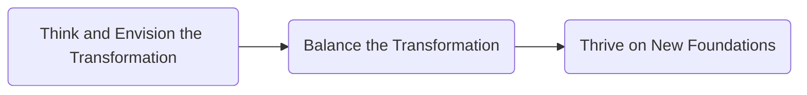
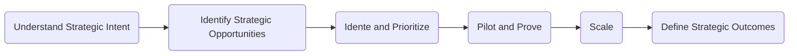
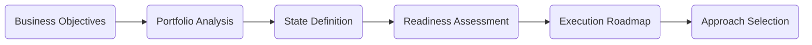
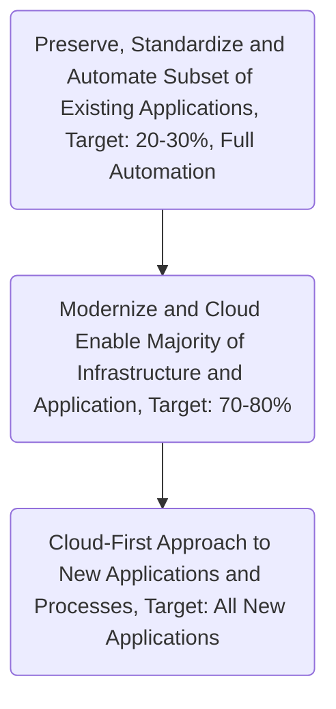

# The Cloud Adoption Playbook

Proven strategies for transforming your organization with the cloud

Author: Moe Abdula, Ingo Averdunk, Roland Barcia, Kyle Brown, Ndu Emuchay (2018)

Borrowed from Pointe-Claire Library, July 2021

[toc]

# Introduction

# 1. Business Drivers

# 2. Framework Overview

Outside-in approach with establishing 3 simple themes:

- ___Think and Envision the Transformation to establish the strategic intent of the transformation.___ This step is the most important one. As we stated earlier, the cloud is a means to an end. First, you must determine what goals the business wants to achieve before your begin any other planning.
- ___Balance the Transformation to decide what works best for the enterprise.___ Just as Rome wasn't built in a day, an enterprise doesn't fully move onto the cloud in a day, or even in a year. There is always a balance that must be struck in understanding what aspects of the digital transformation you can move toward quickly and what parts will take more time.
- ___Thrive on New Foundations to realize the strategic outcomes at scale and over a sustained period (typically, three to five years).___ We want to help build organizations that are successful over the long run, which means going well beyond moving a single project to the cloud or transforming a single development team. To be successful over that time frame, you must establish organizational structures, policies, and procedures that are resilient and effective in the face of a rapidly changing technology landscape.

## Key Dimensions of Cloud Adoption

- Culture and Organization
- Architecture and Technology
- Security and Compliance
- Emerging Innovation Spaces
- Methodology
- Service Management and Operations
- Governance

## Steps in the Adoption Journey

1. Understand Strategic Intent: Understand and evaluate the strategic intent of the business. Prepare for your cloud adoption journey by evaluating technology and understanding key adoption practices and the effects of organizational change.
2. Identify Strategic Opportunities: Identify opportunities to accelerate digital transformation by acknowledging maturity levels across capabilities.
3. Ideate and Prioritize: Evaluate and prioritize ideas and recommendations; leverage attributes such as feasibility, impact, and cost of prioritize transformation activities.
4. Pilot and Prove: Test, prove, and pilot the recommendations; identify measurable outcomes, prove capability and validate with end users and against business-driven measurements.
5. Scale: Scale with validating with end users; take iterative steps to validate approaches, confirm technical decisions, and begin adoption to cloud model at scale.
6. Define Strategic Outcomes: Capitalize on proven successes, learn from feedback, and achieve benefits as you transform business processes.

## The Key Actions of the Framework

1. Involve the Right People
   1) Secure high-level executive sponsorship for the transformation
   2) Identify and engage key line-of-business, technology, and other key stakeholders
   3) Develop and execute a stakeholder communication plan for active engagement
2. Achieve Business and Technology Alignment
3. Take a Holistic Approach across Dimensions
   1. Composability: means that in developing your game plan, you can assemble the elements of the framework that are of high priority to your organization. If the methodology dimension needs shoring up to achieve your goals, for example, you can focus on that dimension while understanding that you need all the other dimensions to complete the whole picture.
   2. Flexibility: means that in these important dimensions, you only need to go to the level of depth required in your context to make decisions that move your plan forward
   3. Agility: means being ready to course-adjust to align with the needs of the business, learning from experimentation, building on the successes of the cloud adoption program, and evaluating and redirecting as needed.
4. Assume an Outside-in, Client-Centered Approach
5. Open the Aperture to New Possibilities
6. Show Progress and Quick Wins
7. Collaborate Actively
8. Balance Sustained and Disruptive Innovation
9. Establish Success Criteria
10. Account for a Multi-cloud Hybrid Model

# 3. Strategy

_A vision without a strategy remains an illusion. -- Lee Bolman_

_Sometimes you have to slow down to speed up._

_Strategy_ is that which enables alignment between vision and execution. (Strategy is a set of integrated decisions that guide you in aligning with a defined vision relative tot he competition.)

A strategy enables you to decide

- what markets to participate in
- how to participate
- what capabilities you must have to be successful (including technology, talent, and skill)

A strategy also tells you

- what management systems need to be in place to be effective
- the time frame in which they need to be executed to be relevant
- how you know that you are succeeding

Important dimensions of cloud strategy:

- Culture and organization
- Architecture and technology
- Security and compliance
- Emerging Innovation Spaces
- Methodology
- Service Management and Operations
- Governance

Prescriptive Steps to Develop a Cloud Strategy:

Key considerations should a Cloud Strategy address?

1. Service types: IaaS, PaaS, SaaS (Data, Cognitive, Solutions)
2. Deployment models (Hosted Private Cloud, Managed Private Cloud, Private Cloud, Dedicated Public Cloud Services, Shared Public Cloud Services)
3. Roles (Consumer, Integrator, Provider)
4. Controls
5. Vendor relationships

## Prescriptive Steps are required to develop a Cloud Strategy

### 1. Define business objectives and constraints

- Competitiveness: the ability to respond to a market opportunity with unique value, often leverage design, technology, and operational excellence as differentiators.
- Agility: the ability to pivot, proactively react, and respond to changing business realities in a rapid, sustained fashion. All part of the organization (business, IT, and supporting functions) must be able to react at (or at nearly) the same pace for the organization to respond in an agile way.
- Speed: the ability to innovate and change faster than your current pace and show results quickly. Speed presumes the ability to do so through more efficient execution across the value stream.
- Cost saving: the ability to take advantage of the collective resource pool, which ultimately means saving money. It requires that you create efficiencies across the value stream without shifting the burden from one side to another.
- Focus: the ability to pay attention to your core business to the exclusion of extraneous activities.

Identify the Constraints: constraints can range from commonly understood restrictions on privacy, locality, security, or data compliance or can be as subtle as existing agreements and timelines.

### 2. Complete analysis of your workload portfolio

Initial questions should revolve around business value:

- What is the real cost benefit of moving those workloads to the cloud?
- How will that migration affect the ecosystem?

Next should consider the risk profile of moving this application:

- What existing (known) risks could this move exacerbate?
- Are there new categories of risk that organization might be exposed to?

Finally, should consider the technical aspects of the migration:

- Is the application designed in a way that is compatible with cloud services?
- Is it technically feasible to "disentagle" the application from others?

Even though cloud environment exhibit immense flexibility, not all workloads are suitable for cloud deployment, so you want to explore new workloads that are enabled by the cloud. Such workloads (e.g. high-volume, low-cost analytics; collaborative business networks; and industry-scale smart applications) can be quickly create business value and enhance innovation for your organization.

### 3. Envision your future state and analyze your current state

Make one value stream mapping.

### 4. Assess your organization's readiness

- Cultural readiness: Stakeholder buy-in, the ability to accept risk, new collaboration models, and new organization structures are all part of the transformation.
- Resourcing readiness: Can you realistically achieve your goals on time, using your existing resources? Understanding your current commitment is the key to making that determination.
- Budgetary readiness: it is both necessary and realistic to project higher operating costs in the early stages of the transformation. Ensuring that you follow an "invest to save" component as part of the strategy will greatly enhance your chances of success.
- Technology readiness
- Process readiness

### 5. Build an execution framework with defined strategic milestones

### 6. Define proven approaches best suited to your organization

We see two approaches at the end of a spectrum: a disruptive innovation approach and an evolutionary (or sustained) innovation approach.

When deciding how to implement cloud, you can use any of four policies:

- __Cloud First__: this is a policy that dictates that you look to the cloud before building in-house capability for the identified suite of apps.
- __Cloud Enabled__: this is a policy that dictates that you may use the cloud if you can get a better outcome than doing things the non-cloud way.
- __Cloud Connected__: This relates to situations in which you would never consider the use of cloud services. System with specific regulatory and compliance issues flat-out disqualify for cloud, for example, but you still need them to participate in a cloud ecosystem.
- __Cloud Only__: This relates to situations in which you use only cloud and never build it in-house. These are often non-critical workloads where you are taking advantage of the best of breed industry solutions or specialized services hosted in the cloud.

Comparing between two approaches:

|           Characteristic           |          Radical / Disruptive          |      Evolutionary / Incremental      |
| :--------------------------------: | :------------------------------------: | :----------------------------------: |
|          Speed of Change           |                 Faster                 |                Slower                |
|       Organizational Change        |                  Much                  |                 Less                 |
|      Experimentation Approach      |               Fail Fast                |              Controlled              |
|          Cost of Failure           |                 Cheap                  |              Expensive               |
| Adaptability to Technology Changes |                  More                  |                 Less                 |
|        Technology Approach         |             New / Refactor             |           New / Integrate            |
|          Policy Emphasis           | Cloud First / Only Connected / Enabled | Cloud Enabled / First Connect / Only |
|       Cloud Technology Stack       |             Hybrid Diverse             |           Hybrid Targeted            |

# 4. Culture and Organization

## What Do We Really Mean by "Culture"?

An _Organizational Culture_ is the combination of the shared values, beliefs, and social norms in an organization, resulting in behaviors, practices, and customs that the members of the organization follow.

An organizational culture provides the reason why a company embraces or rejects different practices.

## Culture Elements make Cloud Adoption Easier or Harder

- Willingness to Embrace Change
- Decision-Make Style
- Attitude toward Risk
- View of Failure

# 5. Architecture and Technology

## List of deliverables Cloud Adoption absolutely required

- Use Case Diagrams
- System Context Diagrams
- Component Diagrams
- Class and Object Diagrams (even though Node was the programming language)
- Sequence Diagrams
- Deployment Diagrams

## Role of Enterprise Architects in Cloud Adoption

As Enterprise Architects empower developers and site reliability engineers to make more decisions during project execution, they can focus more on defining strategy for repeatable success.

### Workload Assessment

The first driver for assessing a workload is always the business requirement. Once it is determined it makes sense from a business perspective, we can assess the technical challenges.

A good starting point to quickly assess a potential workload's general affinity to cloud computing is through answering high-level qualitative questions across a range of criteria.

This type of analysis can explore the following:

- How self-contained the workload is
- What the workload's scalability requirements are
- How standardized the underlying IT infrastructure is
- Whether the workload is available as an application or business process on the cloud
- How substantial the benefit of rapid application deployment for this workload is
- Whether the workload requires strong controls to meeting compliance or regulatory requirements
- What the data transfer requirements for the workload are

Typically, the more connections that are discovered or required, the less suitable the application is for cloud migration. In other words, the cost of migrating to cloud computing may outweigh the benefit. In this case, you might rewrite the application or decide to retire it.

Workload migration strategies:

This above approach has several key challenges:

- Complex cultural transformation limiting the scope and velocity of movement to cloud-native development and management
- Lack of integrated solutions and tools to build new cloud-native applications while integrating and evolving existing applications
- Operational challenges in integrating, managing, and securing cloud and on-premises applications and data

### Reference Architecture

What should the real goal of an architect be? It should be nothing more than __building artifacts that allow the team to successfully implement user stories__.

We must draw some distinctions between the __user stories__ that a product owner naturally creates and other __user stories__ that are just as important. Product owners tend to focus on functional aspects, such as what a system does. An architect, however, should think about nonfunctional aspects: measurable aspects such as page-response time and aspects such as maintainability or manageability, which are harder to measure. Understanding formaulating,and capturing these requirements as user stories are important responsibilities of an application architect.

Sam Newman, in his book _Building Microservices_, writes, "_Architects need to shift their thinking away from creating the perfect end product, and instead focus on helping create a framework in which the right systems can emergeand continue to grow as we learn more._"

#### Architect Roles

- Application Architect: 
  - Think about the boundaries (specifically, functional boundaries and measurable nonfunctional boundaries such as performance) of the sytem being built.
  - They build artifacts that a team needs to implement user stories within those boundaries.
  - These artifacts can be language selection, framework selection, tool choices, code examples, and so on.
  - An application architect should be a skilled developer and can even serve as the lead developer on smaller projects.
- Infrastructure/Cloud Architect
  - Thinks about the critical nonfunctional aspects of infrastructure, management, and administration and about what kind of artifacts the site reliability enginnering (SRE) team needs to do its job.
  - Cloud technology does not eliminateinfrastructure challenges; the architect's skill set must evolve to include skills such as virtualization, integration, networking, security, containers, and storage.
  - These architects also build artifacts for the SRE team to consume, such as event management tools and example code, and logging management tools and example code.

An Enterprise Architect needs to have skills in development and operations beyond concepts. An _Enterprise Architect_ is a decision-maker who has expertise in either development or infrastructure and who can view the big picture. That role is absorbed into one of the two roles above.

#### Components of Reference Architecture

A Reference Architecture should consist of repeatable patterns that solve problems that developers and administrators encounter.

# 6. Security and Compliance

# 7. Emerging Innovation Spaces

# 8. Methodology

A Methodology is nothing more than a description of the guiding principles and set of steps that a team follows in developing a system.

Here is the lightweight software development methodology developed by the IBM Cloud Garage.

The marriage of Agile and DevOps Concepts within a cloud context is what we provide in the IBM Cloud Garage Method.

## IBM Cloud Garage Method

CULTURE is in the center.

Surrounding by the circle: THINK -> CODE -> DELIVER -> RUN -> MANAGE -> LEARN -> back THINK

### Culture

- Building diverse teams.
- Define organizational roles.
- Work in autonomous co-located squads. (follow the squad model of team organization, chapter 4)
- Adopt Agile principles.

### Think

- Use IBM Design Thinking.
- Define a minimum viable product (MVP). (An MVP is the bare-minimum experience that your target persona accepts to accomplish a goal.)
- Hold playbacks.
- Plan iterations by using a rank-ordered backlog.

### Code

- Hold daily standup meetings.
- Use test-driven development (TDD)
- Practice pair programming.
- Continuously integrate.
- Automate testing.

### Deliver

- Deliver continuously by using a pipeline.
- Automate deployments.

### Run

- High Availability (HA) infrastructure
- Dark launch and feature toggles.
- Autoscaling.

### Manage

- Automate monitoring.
- Enable fast recovery.
- Be resilient.
- Automate operations.

### Learn

- Run A/B tests.
- Drive development with hypotheses.

# 9. Service Management and Operations

# 10. Governance