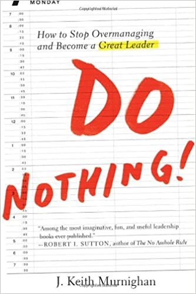

# Do Nothing

Author: J. Keith Murnighan (2012)

_How to Stop Overmanaging and Become a GREAT LEADER_

Borrow: August 2021, Pointe-Claire Library

[toc]

Stop Working and Start Leading --

- Great leaders don't work; they facilitate and orchestrate.
- They think of great strategies and help others implement them.
- They spend their time preparing for the future.
- They take a comprehensive view of their terrain while also noticing key details so they can confidently choose the rigth forks in the road.
- Great leaders don't _do_ anything -- except think, make key decisions, help people do their jobs better, and add a touch of organizational control to make sure the final recipes come out okey.
- In share contrast, most leaders are too busy actually _working_ to do these things -- and their teams suffer as a result.

# Preface

# 1. Do Nothing!

# 2. Focus on Them

# 3. Start at the End

# 4. Trust More

# 5. Release Control (Deviously)

# 6. Bear Down Warmly

# 7. Ignore Performance Goals

# 8. De-emphasize Profits

# 9. Unnatural Leaders

