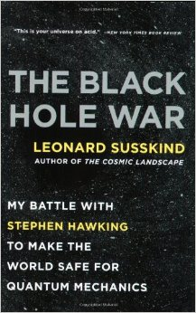
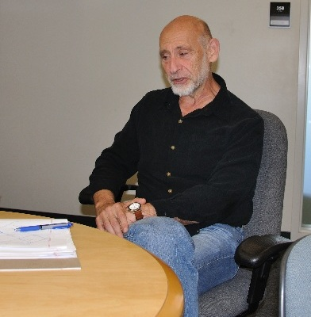
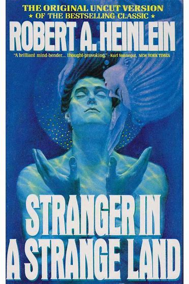
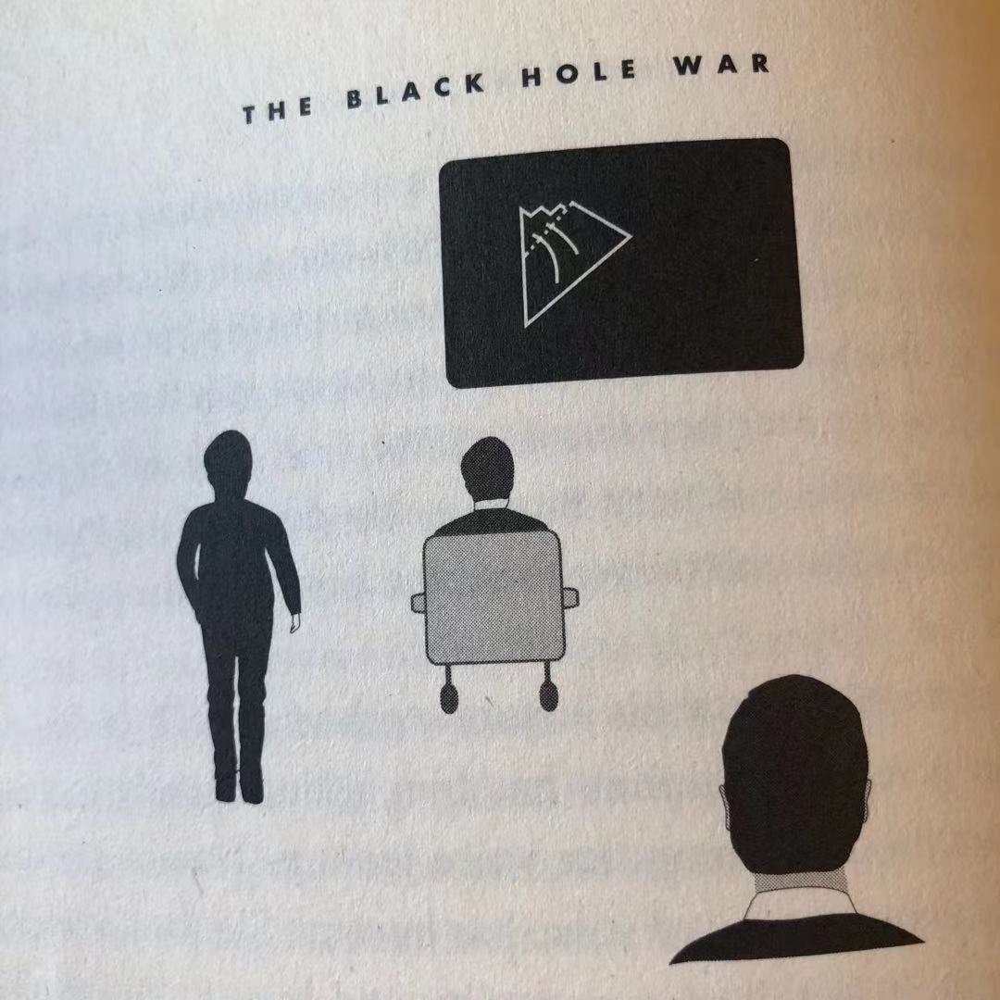

# Black\_Hole\_War

## Black Hole War

\[toc\]

By Leonard Susskind \(2008\)

 

_What is is that breathes fire into the equations and makes a universe for them to describe? -- Stephen Hawking_

## Introduction

_There was so much to grok, so little to grok from. -- Robert A. Heinlein \(Stranger in a Strange Land\)_

The truth, of course, is that all conplex life-forms have built-in, instinctive physics concepts that have been hardwired into their nervous system by evolution. Without this preprogrammed physics software, survival would be impossible. Mutation and natural selection have made us all physicists, even animals. In humans the large size of the brain has allowed there instincts to evolve into concepts that we carry at the conscious level.

...What emerged -- the General Theory of Relativity -- profoundly changed all the traditional ideas about geometry. Space-time became flexible, curved, or warped. It responded to the existence of matter almost like a sheet of rubber under stress. Previously, space-time had been passive, its geometric properties fixed. In the General Theory, space-time became an active player: it could be deformed by massive objects such as planets and stars, but it could not be visualized -- not without a lot of additional mathematics anyway.

...By the early 1950s, Richard Feynman, Julian Schwinger, Sin-Itiro Tomanaga, and Freeman Dyson had laid the groundwork for a synthesis of _Special_ Relativity and Quantum Mechanics called **Quantum Field Theory**. But the _General_ Theory of Relativity \(Einstein's synthesis of Special Relativity and Newton's theory of gravity\) and Quantum Mechanics remained irreconcilable, though not from lack of trying. ...

Today it is widely believed that gravity and Quantum Mechanics will play equally important roles in determining the laws of **elementary particles \(基本粒子\)**. ... The new wiring, whatever it is, will be called _quantum gravity_, but even without knowing its detailed form, we can safely say that the new paradigm will involve very unfamiliar concepts of space and tie.

...Quantum Gravity deals with objects a hundred billion billion times smaller than a proton. We have never directly experienced such small things, and we probably never will, but human ingenuity has allowed us to deduce their existence, and surprisingly, the portals into that world are objects of huge mass and size: _black holes_.

... The Holographic Prinicle \(全息原理\) is one of the most unintutive abstractions in all of physics. ...

#### some big and small numbers

The Earth's population is roughly 7 billion = $7 \* 10^9$

Number of protons and neutrons in Earth \(approximately\) $= 5 \* 10^{51}$

The total number of electrons in the portion of the universe that we can see with the most powerful telescopes is about $10^{80}$. The total number of protons is about $10^{90}$.

The size of an atom is about one tem-billion of a meter:

$Size \quad of \quad atom = 0.0000000001 \quad meters = 10^{-10}$.

The mass of an electron is about $9 \* 10^{-31}$.

A _googol_ is $10^100$, and a _googolplex_ is $10^{googol}$.

## Part 1 The Gathering Storm

_History will be kind to me, for I intend to write it. -- Winston Churchill_

### 01. The First Shot

One the blackboard was a _Penrose Diagram_, a type of diagram representing a black hole. The horizon \(the edge of the black hole\) was drawn as a dashed line, and the singularity at the center of the black hole was an ominous-looking jagged line. Lines pointing inward through the horizon represented bits of information falling past the horizon into the singularity. There were no lines coming back out. According to Stephen, those bits were irretrievably \(无可挽回地\) lost. To make matters worse, Stephen had proved that black holes eventually evaporate and disappear, leaving no trace of what has fallen in.

...We were very suspicious of Stephen's claim, but for a while we weren't sure why. What's so bad about losing a bit of information inside a black hole? Then it drawned on us. Losing information is the same as generating entropy. And generating entropy means generating heat. The virtual black holes that Stephen had so blithely postulated would create heat in empty space. ... We found that if Stephen was right, empty space would heat up to a thousand billion billion billion degrees in a tiny fraction of a second. ...

### 02. The Dark Star

_There are more things in heaven and earth, Horatio, Than are dreamt of in your philosophy. -- William Shakespeare, Hamlet_

&lt;&lt;&lt;&lt;&lt;&lt;&lt; HEAD

### 03. Not Your Grandfather's Geometry

## ..._time delation_\(时间膨胀\): rapidly moving clocks run slowly compared to slow clocks or clocks at rest.

The escape velocity from the surface of the Earth is a mighty 25,000 miles per hour.

> > > > > > > e1ceaa327caf607cea8ab28209d67b419f71668d

Shrinking a star \(without losing any mass\) increases the escape velocity.

### 04. "Einstein, Don't Tell God Want to Do"

### 05. Planck Invents a Better Yardstick

### 06. In a Broadway Bar

### 07. Energy and Entropy

### 08. Wheeler's Boys, or How Much Information Can You Stuff in a Black Hole?

### 09. Black Light

## Part II Surprise Attack

### 10. How Stephen Lost His Bits and Didn't Know Where to Find Them

### 11. The Dutch Resistance

### 12. Who Cares?

### 13. Stalemate

### 14. Stirmish at Aspen

## Part III CounterAttack

### 15. The Battle of Santa Barbara

### 16. Wait! Reverse the Rewiring

### 17. Ahab in Cambridge

### 18. The World as a Hologram

## Part IV Closing the Ring

### 19. Weapon of Mass Deduction

### 20. Alice's Airplance, or The Last Visible Propeller

### 21. Counting Black Holes

### 22. South America Wins the War

### 23. Nuclear Physics? You're Kidding!

### 24. Humility

