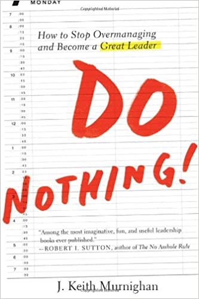

# Do\_Nothing

## Do Nothing

Author: J. Keith Murnighan \(2012\)

_How to Stop Overmanaging and Become a GREAT LEADER_

Borrow: August 2021, Pointe-Claire Library

\[toc\]

Stop Working and Start Leading --

* Great leaders don't work; they facilitate and orchestrate.
* They think of great strategies and help others implement them.
* They spend their time preparing for the future.
* They take a comprehensive view of their terrain while also noticing key details so they can confidently choose the right forks in the road.
* Great leaders don't _do_ anything -- except think, make key decisions, help people do their jobs better, and add a touch of organizational control to make sure the final recipes come out okay.
* In share contrast, most leaders are too busy actually _working_ to do these things -- and their teams suffer as a result.

## Preface

We can't escape our ancestors, however, and the influence that their successes have had on the way we live our lives. In particular, they endowed \(赋予\) us with a natural inclination to actively pursue our goals -- so much so that **not acting feels terribly wrong**. This legacy is tremendously helpful -- until we become leaders. Then our natural tendencies \(倾向\) to act lead us to do too much. This is the curve of over-managing, and far too many leaders fall under its spell. _Do Nothing!_ shows you why you much fight this natural tendency, both in your thoughts and in your actions.

Leaders have a tremendous, trickle-down impact on scores of people: one great leader can have a host of positive effects on hundreds, sometimes a thousands of people. Organizations are reflections of their leaders, and if their leaders can be more effective and avoid over-managing, many, many people will benefit.

## 1. Do Nothing!

The KEY insight here is simple: you will be a more effective leader if, rather than doing the work yourself, you let other people do it. In other words, stop working and start leading.

As you move up in the world, people will look to you to think big thoughts and orchestrate the big issues; they will want you to use broad brush-strokes rather than focusing on details -- even if you are really good at being a detail person.

A simple solution can allow you to success at doing less: figure out who among your team members is good at a particular job _and let them do it_ -- even if it's something that you can do well.

"Don't let perfect interfere with good enough." --- "comparative advantage"

... particularly important for leaders: your comparative advantage, as a leader, is _not_ to get involved in doing different jobs. Instead, you must focus on facilitating others' performance and orchestrating their actions so that they combine their efforts into the most effective final product.

This is what great leaders do. ---

* They don't work; the facilitate and orchestrate.
* They think of great strategies and help other people implement them.
* They spend their time on achieving the foresight to be able to see new developments as or just before they happen.
* They take a broad, comprehensive view of their terrain \(倾向\) while they also notice some of the key details so they can confidently choose the best of many possible forks in the road.
* They don't do anything -- except think, make key decisions, help people do their jobs better, and add a touch of organizational control to make sure the final recipes come out okay.

**Leaders who are too busy working, doing a job, can't do these \(above\) things -- and their teams suffer.**

Doing Nothing is not easy for people who like their work and are driven to succeed. It is also not easy for people whose ancestors had to work hard just to survive. But if you can get yourself to _Do Nothing_, you will soon find that your team members will grow as a TEAM, and you will grow as a LEADER. _You just have to get out of their way_.

Here's what you can actually do: to be a truly effective leader, you should be a _facilitator_ and an _orchestrator_.

* Rather than doing work that your team members can do, help them do their jobs better.
* Facilitate their performance rather than interfering with it.
* Then add a touch of orchestration, to make sure that Annie finishes her work before William does his so that everything will be ready at the right time.
* When you facilitate and orchestrate will, your team members will work well, individually and collectively.

A leader's job is _not_ to do things. Instead, leaders do best when they help other people do as much as they can as well as they can. If each and every member of a team lives up to their maximum potential, the team and its leader will be as successful as they can possibly be.

### What Will You Do While You Are Doing Nothing?

If you succeed in Doing Nothing, how will you spend your time at work?

* First of all, you will have time to plan for the future -- an unusual luxury.
* Next, you can work to facilitate your team members' performance, and you can do that without really doing anything yourself.
* As you facilitate, you should have high expectations for their performance: by expecting a lot from your people, you will generally get a lot. This is what researchers have called the Pygmalion Effect \(皮格马利翁效应\).

## 2. Focus on Them

... to empathize with someone in pain, whether form hunger or fatigue, it appears that you must be experiencing pain yourself -- you can't just imagine the feeling. ...people must also have _directly related experiences_ to truly feel empathy for another person.

**The Leadership Law**: Think of the reaction that you want first, then determine the actions you can take to maximize the chances that those reactions will actually happen.

## 3. Start at the End

Having clear expectations of one another makes it easier to adjust to a world that is rapidly changing. Thus, to be continuously effective, you must also be prepared to lead your team on all sorts of potentially unexpected jobs.

## 4. Trust More

## 5. Release Control \(Deviously\)

## 6. Bear Down Warmly

## 7. Ignore Performance Goals

As a leader, you can control the work process, but you can't control its outcomes.

* _You can't control the wind, but you can adjust your sails. \(Yiddish\)_
* _Pray to God, but row for shore. \(Russian\)_
* _There is no bad weather, only bad judgment. \(Kiwi\)_
* _It's better to light a candle than to curse the darkness. \(與其詛咒黑暗,不如點燃蠟燭\) \(Chinese\)_
* _Trust in Allah, but tie your camel. \(Arabic\)_

**Outcomes = f\(Ability + a lot of other stuff\)**

## 8. De-emphasize Profits

## 9. Unnatural Leaders

